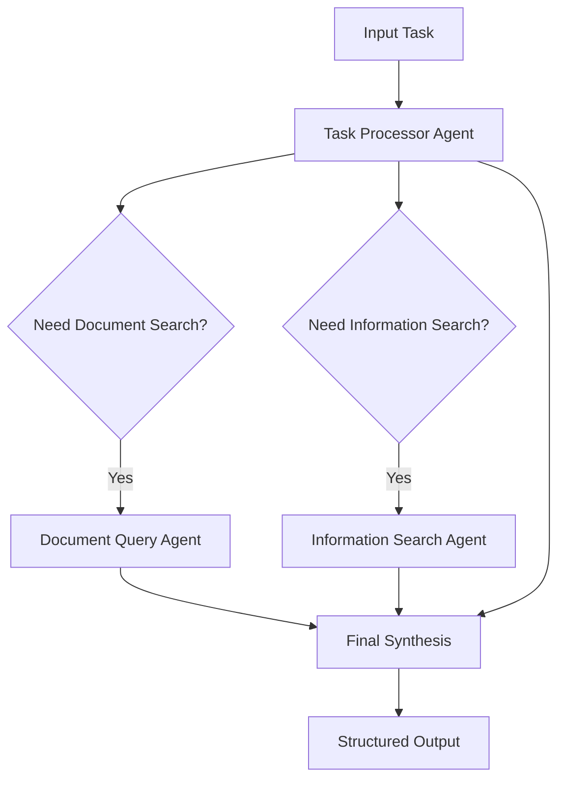

# Agentic Workflow System for Thai Educational AI

This document describes the implementation of a multi-agent workflow system designed specifically for Thai educational content generation using LangChain.

## Architecture Overview

The system consists of three specialized agents that work together to process complex educational tasks:

### 🔄 Task Processor Agent (`taskProcessorAgent.ts`)
**Role**: Task Analysis and Planning
- Analyzes incoming educational tasks
- Determines what types of information are needed
- Plans the execution strategy
- Specifies expected output formats

**Key Features**:
- Uses GPT-4o for intelligent task analysis
- Structured output with Zod schema validation
- Determines need for document search vs. external information search
- Optimized for Thai educational context

### 📚 Document Query Agent (`documentQueryAgent.ts`)
**Role**: Internal Document Search and Analysis
- Searches curriculum documents (CSV, PDF, DOCX)
- Retrieves relevant document chunks using vector similarity
- Synthesizes information from multiple document sources
- Provides confidence scoring and source references

**Key Features**:
- Integrated with existing `docsQuery` system
- Supports multiple document types and formats
- Contextual document analysis for Thai curriculum standards
- Confidence-based decision making

### 🌐 Information Search Agent (`informationSearchAgent.ts`)
**Role**: External Information Retrieval
- Performs web searches for additional educational resources
- Optimized for Thai educational content (Google search with `th` locale)
- Synthesizes and evaluates external information relevance
- Enhances search queries based on context

**Key Features**:
- Uses SerpAPI for Google search integration
- Query optimization for better search results
- Information synthesis and relevance scoring
- Thai language and educational context awareness

## Workflow Process



## Usage Examples

### Basic Usage
```typescript
import { AgenticWorkflow } from "@/lib/agents/agenticWorkflow";

const workflow = new AgenticWorkflow();

const result = await workflow.executeWorkflow({
  task: "หาข้อมูลมาตรฐานการเรียนรู้สำหรับวิทยาศาสตร์ ม.1",
  stepType: "0",
  context: "กำลังค้นหาข้อมูลหลักสูตร"
});

console.log("Result:", result.result);
console.log("Confidence:", result.confidence);
console.log("Sources:", result.sourcesUsed);
```

### Advanced Usage with Session Data
```typescript
const result = await workflow.executeWorkflow({
  task: "ออกแบบกิจกรรมการเรียนรู้แบบ UDL",
  stepType: "2",
  sessionData: {
    subject: "วิทยาศาสตร์",
    level: "ม.1",
    numStudents: 30,
    studentType: [
      { type: "นักเรียนปกติ", percentage: 70 },
      { type: "นักเรียนที่ต้องการความช่วยเหลือพิเศษ", percentage: 30 }
    ]
  }
});
```

## Integration with Existing System

The agentic workflow has been integrated into the existing API structure:

### Updated Route Handler
- `callAgenticQueryLLM()` function provides enhanced processing
- Backward compatibility maintained with existing `callQueryLLM()`
- Confidence scoring and source tracking added to API responses

### Enhanced Response Format
```typescript
{
  response: { /* Original response data */ },
  agenticMetadata: {
    confidence: 0.85,
    sourcesUsed: ["Curriculum documents", "External educational resources"],
    processingSteps: [
      "Task analysis and planning",
      "Document search and analysis", 
      "Information synthesis and response generation"
    ]
  }
}
```

## Configuration

### Environment Variables Required
```env
OPENAI_API_KEY=your_openai_api_key
SERPAPI_API_KEY=your_serpapi_key  # For external search capability
JWT_SECRET=your_jwt_secret
```

### Document Paths
The system uses these default document paths:
- Curriculum: `src/data/curriculum.csv`
- Templates: `src/data/curriculum_template.docx`

## Performance Considerations

### Parallel Processing
- Agents can work in parallel when both document and information search are needed
- Reduces total processing time for complex queries

### Caching
- Document retrievers are cached in the `docsQuery` system
- Vector embeddings are reused across similar queries
- LLM responses can be cached for identical tasks

### Cost Optimization
- Task Processor uses lower temperature (0.3) for consistent analysis
- Document queries are optimized to retrieve only relevant chunks
- Information search is triggered only when necessary

## Testing

Run the test suite to verify agent functionality:

```typescript
import { testAgenticWorkflow } from "@/lib/agents/testAgenticWorkflow";

await testAgenticWorkflow();
```

The test suite covers:
1. Simple curriculum queries (document search)
2. Learning objective generation (mixed sources)
3. Complex activity design (multiple agent coordination)

## Future Enhancements

### Planned Features
1. **Memory System**: Persistent context across multiple queries
2. **Agent Learning**: Improve agent decisions based on past performance
3. **Multi-language Support**: Extend beyond Thai to other languages
4. **Custom Agent Training**: Fine-tune agents for specific educational domains

### Scalability
- Agent pooling for concurrent request handling
- Distributed processing for large-scale deployments
- Real-time performance monitoring and optimization

## Troubleshooting

### Common Issues
1. **Missing API Keys**: Ensure all environment variables are set
2. **Document Not Found**: Check file paths and permissions
3. **Low Confidence Scores**: May indicate insufficient source material
4. **Timeout Errors**: Increase timeout limits for complex queries

### Debug Mode
Enable detailed logging by setting:
```env
NODE_ENV=development
```

This will show detailed agent communication and decision-making processes.
