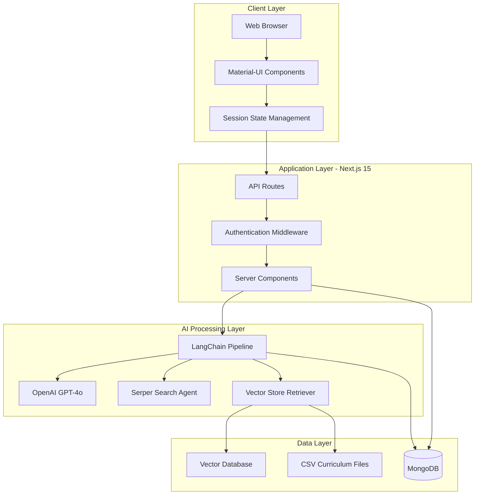
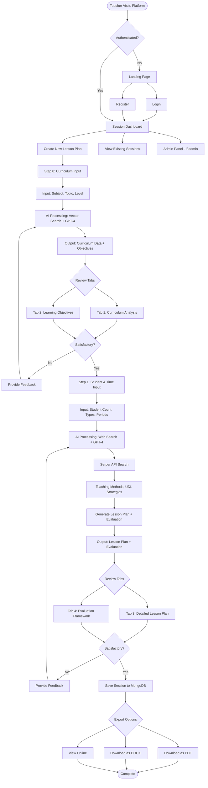

# Inclusive Learning AI Platform - Complete Documentation


## 📚 Table of Contents

- [Executive Summary](#executive-summary)
- [Platform Purpose](#platform-purpose)
- [Technology Stack](#technology-stack)
- [System Architecture](#system-architecture)
- [User Flow](#user-flow)
- [Database Architecture](#database-architecture)
- [API Documentation](#api-documentation)
- [AI Pipeline](#ai-pipeline)
- [Features](#features)
- [Installation & Setup](#installation--setup)
- [Use Cases](#use-cases)
- [Future Enhancements](#future-enhancements)

---

## 🎯 Executive Summary

**Inclusive Learning AI** is an advanced educational technology platform that leverages artificial intelligence to empower teachers in creating inclusive, curriculum-aligned, and pedagogically sound lesson plans. Built by Prof. Dr. Jaitip Na Songkhla and Thitanat Na Songkhla, the platform addresses the critical challenge of designing effective learning experiences for diverse student populations.

### Quick Stats
- **Platform Type**: Web-based AI Assistant
- **Primary Users**: K-12 Teachers in Thailand
- **Technology**: Next.js 15, GPT-4o, LangChain, MongoDB
- **Core Function**: AI-powered inclusive lesson planning
- **Methodology**: Universal Design for Learning (UDL)
- **Deployment**: Production-ready (Port 3005)

---

## 🌟 Platform Purpose

### Problem Statement

Modern classrooms are increasingly diverse, with students exhibiting:
- Varied learning abilities and styles
- Different physical and cognitive capabilities
- Diverse cultural and linguistic backgrounds
- Special educational needs requiring accommodations

Traditional lesson planning approaches:
- ❌ Take extensive time (5-10 hours per comprehensive plan)
- ❌ Often fail to address all learner types
- ❌ May not align with curriculum standards
- ❌ Lack research-backed pedagogical strategies
- ❌ Require specialized training in inclusive education

### Solution

Inclusive Learning AI provides:
- ✅ **Automated Lesson Planning**: Reduces planning time from hours to minutes
- ✅ **UDL Integration**: Built-in Universal Design for Learning principles
- ✅ **Curriculum Alignment**: Vector search ensures adherence to Thai educational standards
- ✅ **Differentiated Instruction**: Automatic adaptations for diverse learners
- ✅ **Research-Backed**: Real-time web search for current best practices
- ✅ **Inclusive by Default**: Every activity includes accommodations

### Educational Impact

**For Teachers:**
- Dramatically reduced planning workload
- Professional development through AI-suggested strategies
- Confidence in meeting diverse student needs
- Curriculum compliance assurance

**For Students:**
- Equitable access to quality education
- Learning experiences tailored to their needs
- Multiple means of engagement and expression
- Improved learning outcomes across all ability levels

---

## 🛠 Technology Stack

### Frontend
| Technology | Version | Purpose |
|------------|---------|---------|
| **Next.js** | 15.1.7 | React framework with server-side rendering |
| **React** | 19.0.0 | UI component library |
| **TypeScript** | 5.x | Type-safe JavaScript |
| **Material-UI (MUI)** | Latest | Component library & design system |
| **TailwindCSS** | 3.4.1 | Utility-first CSS framework |

### Backend & AI
| Technology | Version | Purpose |
|------------|---------|---------|
| **OpenAI GPT-4o** | Latest | Primary language model for generation |
| **LangChain** | 0.3.31 | AI orchestration & prompt management |
| **Serper API** | Latest | Real-time web search integration |
| **Pinecone/HNSWLib** | Latest | Vector database for curriculum retrieval |
| **Puppeteer** | 24.10.2 | PDF generation & web scraping |

### Database & Storage
| Technology | Version | Purpose |
|------------|---------|---------|
| **MongoDB** | 6.13 | Primary NoSQL database |
| **Mongoose** | 8.10.1 | MongoDB object modeling |

### Authentication & Security
| Technology | Purpose |
|------------|---------|
| **JSON Web Tokens (JWT)** | Stateless authentication |
| **bcrypt** | Password hashing |

### Additional Libraries
- **Axios**: HTTP client for API requests
- **Cheerio**: HTML parsing for web scraping
- **Mammoth**: DOCX file processing
- **PDF-Lib**: PDF manipulation
- **csv-parser**: CSV data parsing

---

## 🏗 System Architecture

### High-Level Architecture



### Component Architecture

```
┌────────────────────────────────────────────────────────────┐
│                     Client Browser                          │
│  ┌──────────────────────────────────────────────────────┐  │
│  │  Landing Page → Login/Register → Session Dashboard   │  │
│  └──────────────────────────────────────────────────────┘  │
└────────────────────────────────────────────────────────────┘
                            ↓
┌────────────────────────────────────────────────────────────┐
│                  Next.js API Routes                         │
│  ┌────────────┬──────────────┬─────────────────────────┐   │
│  │   /auth    │   /session   │    /chat/step/*         │   │
│  │  • login   │   • create   │  • combined-0           │   │
│  │  • register│   • update   │  • 2-agent              │   │
│  │            │   • delete   │  • combined-1           │   │
│  └────────────┴──────────────┴─────────────────────────┘   │
└────────────────────────────────────────────────────────────┘
                            ↓
┌────────────────────────────────────────────────────────────┐
│              Optimized Lesson Pipeline                      │
│  ┌──────────────────────────────────────────────────────┐  │
│  │  Step 0: Curriculum Analysis + Learning Objectives   │  │
│  │  Step 2: Lesson Planning (Enhanced with Web Search) │  │
│  │  Step 3: Evaluation Framework Generation            │  │
│  └──────────────────────────────────────────────────────┘  │
└────────────────────────────────────────────────────────────┘
                            ↓
┌────────────────────────────────────────────────────────────┐
│                    Data Persistence                         │
│  ┌───────────────┬──────────────────┬──────────────────┐   │
│  │  MongoDB      │  Vector Store    │  CSV Files       │   │
│  │  • users      │  • Curriculum    │  • Curriculum    │   │
│  │  • sessions   │    Embeddings    │    Standards     │   │
│  └───────────────┴──────────────────┴──────────────────┘   │
└────────────────────────────────────────────────────────────┘
```

---

## 👥 User Flow

### Complete User Journey



### Step-by-Step Breakdown

#### **Phase 1: Authentication (30 seconds)**

**Landing Page Features:**
- Platform introduction with 6 key features displayed
- Glassmorphism design with Chulalongkorn University branding
- Two call-to-action buttons: "เริ่มต้นใช้งาน" and "สมัครสมาชิก"

**Registration:**
1. User clicks "สมัครสมาชิก" (Register)
2. Fills form: Email, Password, First Name, Last Name
3. System validates and hashes password with bcrypt
4. Creates user record in MongoDB
5. Generates JWT token
6. Redirects to Session Dashboard

**Login:**
1. User enters email and password
2. System verifies credentials
3. Generates JWT token (stored in localStorage)
4. Redirects to Session Dashboard

---

#### **Phase 2: Session Dashboard (Ongoing)**

**Dashboard Features:**
- View all previous lesson plans
- Create new lesson plan
- Edit existing sessions
- Delete sessions
- Admin panel (for administrators)
- Logout functionality

---

#### **Phase 3: Lesson Creation - Step 0 (3-5 minutes)**

**User Input:**
```
┌─────────────────────────────────────┐
│  กลุ่มสาระ (Subject):              │
│  ▼ วิทยาศาสตร์และเทคโนโลยี        │
│                                     │
│  เรื่อง (Lesson Topic):            │
│  [การเปลี่ยนแปลงสภาพของสสาร]       │
│                                     │
│  ระดับชั้น (Grade Level):          │
│  ▼ มัธยมศึกษาปีที่ 3               │
│                                     │
│  [ดำเนินการต่อ] ────────────────>  │
└─────────────────────────────────────┘
```

**AI Processing:**
1. **Vector Search** (1-2 seconds)
   - Searches curriculum CSV files using embedded query
   - Retrieves top 10 most relevant curriculum documents
   - Extracts: Standards (มาตรฐาน), Interim Indicators, Final Indicators

2. **GPT-4 Analysis** (5-10 seconds)
   - Analyzes retrieved curriculum data
   - Generates detailed content outline
   - Creates learning summary

3. **Objectives Generation** (3-5 seconds)
   - Creates specific, measurable learning objectives
   - Aligns with curriculum standards
   - Defines key competencies

**Output Displayed in Tabs:**

**Tab 1: ข้อมูลหลักสูตร (Curriculum Data)**
```json
{
  "มาตรฐาน": "ว 4.1 - เข้าใจสสารและการเปลี่ยนแปลงของสสาร",
  "ตัวชี้วัดระหว่างทาง": [
    "อธิบายสถานะของสสารและการเปลี่ยนแปลงสถานะ",
    "วิเคราะห์ปัจจัยที่มีผลต่อการเปลี่ยนแปลง"
  ],
  "ตัวชี้วัดปลายทาง": [
    "สามารถออกแบบการทดลองเกี่ยวกับการเปลี่ยนแปลงสภาพสสาร",
    "สามารถอธิบายการเปลี่ยนแปลงสภาพสสารในชีวิตประจำวัน"
  ],
  "เนื้อหา": {
    "1": "สถานะของสสาร (แข็ง เหลว ก๊าซ)",
    "2": "การเปลี่ยนสถานะจากแข็งเป็นเหลว (การหลอมเหลว)",
    "3": "การเปลี่ยนสถานะจากเหลวเป็นก๊าซ (การระเหย)",
    ...
  }
}
```

**Tab 2: จุดประสงค์การเรียนรู้ (Learning Objectives)**
```json
{
  "จุดประสงค์การเรียนรู้": {
    "1": "นักเรียนสามารถอธิบายสถานะของสสารและลักษณะเฉพาะได้",
    "2": "นักเรียนสามารถวิเคราะห์ปัจจัยที่ส่งผลต่อการเปลี่ยนแปลงสถานะ",
    "3": "นักเรียนสามารถออกแบบและทำการทดลองเกี่ยวกับการเปลี่ยนแปลงสภาพสสาร"
  },
  "สมรรถนะผู้เรียน": {
    "5.1": "ความสามารถในการสื่อสาร",
    "5.2": "ความสามารถในการคิด",
    "5.3": "ความสามารถในการแก้ปัญหา",
    "5.4": "ความสามารถในการใช้ทักษะชีวิต"
  }
}
```

**User Decision Point:**
- ✅ Satisfied → Proceed to Step 1
- ❌ Not satisfied → Provide feedback → AI regenerates

---

#### **Phase 4: Lesson Creation - Step 1 (5-8 minutes)**

**User Input:**
```
┌─────────────────────────────────────────────┐
│  จำนวนนักเรียน (Number of Students):      │
│  [30] คน                                   │
│                                             │
│  ประเภทนักเรียน (Student Types):           │
│  ┌─────────────────────────────────────┐   │
│  │ ประเภท            │  เปอร์เซ็นต์    │   │
│  ├─────────────────────────────────────┤   │
│  │ นักเรียนปกติ       │  [60]%         │   │
│  │ นักเรียนความต้องการพิเศษ │ [20]%    │   │
│  │ นักเรียนความสามารถสูง │  [20]%      │   │
│  └─────────────────────────────────────┘   │
│                                             │
│  จำนวนคาบเรียน (Study Periods):           │
│  [9] คาบ (450 นาที)                        │
│                                             │
│  [สร้างแผนการสอน] ─────────────────────>  │
└─────────────────────────────────────────────┘
```

**AI Processing - Enhanced with Web Search:**

**Phase 2.1: Web Search (10-15 seconds)**
```
🔍 Searching with Serper API...

Query 1: "กระบวนการการจัดกิจกรรมการสอน วิทยาศาสตร์ การเปลี่ยนแปลงสภาพของสสาร มัธยม"
Query 2: "teaching methodology science state changes grade 8"
Query 3: "5E model lesson plan science Thailand"
Query 4: "UDL strategies science inclusive classroom"
Query 5: "differentiated instruction special needs science"

Results Retrieved:
✓ Teaching Process Examples: 5E Model, Problem-Based Learning, Inquiry-Based
✓ Lesson Details: Specific science concepts and experiments
✓ UDL Strategies: Multiple representations, engagement methods
✓ Inclusive Strategies: Differentiation techniques, collaborative learning
```

**Phase 2.2: Lesson Plan Generation (15-25 seconds)**
```
🎯 Generating comprehensive lesson plan...

Using:
- Retrieved web data on teaching methodologies
- Student type distribution (60% typical, 20% special needs, 20% gifted)
- Time allocation: 450 minutes total
- UDL principles: Multiple means of representation, engagement, expression
- Curriculum standards from Step 0

Creating:
✓ Main learning phases (Engage, Explore, Explain, Elaborate, Evaluate)
✓ Sub-activities for each phase with time allocations
✓ Detailed procedures, materials, roles
✓ Adaptations for each student type
✓ Teaching materials list
```

**Phase 2.3: Evaluation Framework Generation (5-8 seconds)**
```
📊 Creating evaluation framework...

Generating:
✓ Assessment criteria aligned with objectives
✓ Rubrics for interim and final indicators
✓ Multiple assessment methods (formative, summative)
✓ Evaluation tools for diverse learners
```

**Output Displayed in Tabs:**

**Tab 3: แผนการจัดการเรียนรู้ (Detailed Lesson Plan)**
```json
{
  "กิจกรรมการเรียนรู้": {
    "8.1 ขั้นนำเข้าสู่บทเรียน (50 นาที)": {
      "1 กิจกรรมกระตุ้นความสนใจ (20 นาที)": {
        "รายละเอียดการดำเนินการ": "ครูนำเสนอวิดีโอ...",
        "สื่อ/อุปกรณ์การสอน": "วิดีโอการเปลี่ยนสถานะ, โปรเจคเตอร์",
        "บทบาทผู้เรียน": "สังเกต ถามคำถาม แสดงความคิดเห็น",
        "บทบาทครู": "นำเสนอ กระตุ้น อำนวยความสะดวก",
        "แนวทางการปรับกิจกรรมสำหรับผู้เรียนที่หลากหลาย": {
          "นักเรียนที่มีความต้องการพิเศษ": "ให้ใช้ภาพประกอบเพิ่ม...",
          "นักเรียนความสามารถสูง": "ให้วิเคราะห์ปรากฏการณ์เชิงลึก..."
        }
      },
      "2 การเชื่อมโยงกับความรู้เดิม (30 นาที)": {
        ...
      }
    },
    "8.2 ขั้นสำรวจและทดลอง (100 นาที)": {
      "1 การออกแบบการทดลอง (40 นาที)": {
        ...
      },
      "2 การทำการทดลอง (60 นาที)": {
        ...
      }
    },
    "8.3 ขั้นอธิบายและสรุป (150 นาที)": {
      ...
    },
    "8.4 ขั้นขยายความรู้ (100 นาที)": {
      ...
    },
    "8.5 ขั้นประเมินผล (50 นาที)": {
      ...
    }
  },
  "สื่อและอุปกรณ์": {
    "1": "อุปกรณ์การทดลอง: น้ำแข็ง, เตาอ่อนไฟ, บีกเกอร์, เทอร์โมมิเตอร์",
    "2": "เทคโนโลยี: คอมพิวเตอร์, โปรเจคเตอร์, แอปพลิเคชัน PhET Simulation",
    "3": "สื่อการเรียนรู้: ใบงาน, กราฟ, โมเดลโมเลกุล 3 มิติ"
  },
  "การใช้ข้อมูลจากการค้นคว้า": {
    "ตัวอย่างกระบวนการที่นำมาใช้": "5E Learning Cycle และ Inquiry-Based Learning",
    "กลยุทธ์ UDL ที่ใช้": "Multiple Representations ด้วยวิดีโอ, การทดลอง, และโมเดล",
    "กลยุทธ์ Inclusive ที่ใช้": "Differentiated Tasks และ Collaborative Grouping"
  }
}
```

**Tab 4: การประเมินผล (Evaluation Framework)**
```json
{
  "การประเมินผล": {
    "1 การประเมินระหว่างเรียน (Formative)": {
      "วิธีการ": "สังเกตการณ์, คำถาม, ใบงาน",
      "เกณฑ์": "ความเข้าใจแนวคิด, การมีส่วนร่วม, ทักษะกระบวนการ"
    },
    "2 การประเมินปลายทาง (Summative)": {
      "วิธีการ": "รายงานการทดลอง, การนำเสนอ, แบบทดสอบ",
      "เกณฑ์การให้คะแนน": {
        "4": "เข้าใจและประยุกต์ได้ดีเยี่ยม",
        "3": "เข้าใจและประยุกต์ได้ดี",
        "2": "เข้าใจพื้นฐาน",
        "1": "ต้องพัฒนา"
      }
    }
  }
}
```

**User Decision Point:**
- ✅ Satisfied → Save session
- ❌ Not satisfied → Provide feedback → AI regenerates

---

#### **Phase 5: Session Management (Ongoing)**

**Save & Export:**
1. Session automatically saved to MongoDB
2. Export options:
   - **PDF**: Complete lesson plan document
   - **DOCX**: Editable Word document
   - **Online View**: Access anytime from dashboard

**Edit & Iterate:**
- Teachers can return to any saved session
- Modify inputs and regenerate
- Track version history

---

## 🗄 Database Architecture

### MongoDB Collections

#### **users Collection**

**Schema:**
```typescript
{
  _id: ObjectId,
  email: string,           // Unique, indexed
  password: string,        // Bcrypt hashed
  firstName: string,
  lastName: string,
  createdAt: Date,        // Auto-generated
  updatedAt: Date         // Auto-generated
}
```

**Sample Document:**
```json
{
  "_id": "507f1f77bcf86cd799439011",
  "email": "somchai@school.ac.th",
  "password": "$2b$10$EixZaYVK1fsbw1ZfbX3OXePaWxn96p36",
  "firstName": "สมชาย",
  "lastName": "ครูดี",
  "createdAt": "2025-01-15T09:00:00.000Z",
  "updatedAt": "2025-01-15T09:00:00.000Z"
}
```

**Indexes:**
```javascript
db.users.createIndex({ email: 1 }, { unique: true })
db.users.createIndex({ createdAt: -1 })
```

---

#### **sessions Collection**

**Schema:**
```typescript
{
  _id: ObjectId,
  userId: ObjectId,              // Reference to users collection
  subject: string,               // กลุ่มสาระ
  lessonTopic: string,          // เรื่อง
  level: string,                // ระดับชั้น
  standard: string,             // มาตรฐาน
  interimIndicators: array,     // ตัวชี้วัดระหว่างทาง
  finalIndicators: array,       // ตัวชี้วัดปลายทาง
  content: object,              // เนื้อหา
  summary: string,              // สรุป
  objectives: object,           // จุดประสงค์
  competencies: object,         // สมรรถนะ
  numStudents: number,          // จำนวนนักเรียน
  studentTypes: array,          // ประเภทนักเรียน
  studyPeriod: number,          // จำนวนคาบ
  lessonPlan: object,           // แผนการสอน
  teachingMaterials: object,    // สื่อและอุปกรณ์
  evaluation: object,           // การประเมินผล
  enhancedData: object,         // ข้อมูลจากการค้นหา
  searchMetadata: object,       // Metadata การค้นหา
  feedback: array,              // Feedback จากครู
  version: number,              // Version number
  createdAt: Date,
  updatedAt: Date
}
```

**Sample Document:**
```json
{
  "_id": "507f191e810c19729de860ea",
  "userId": "507f1f77bcf86cd799439011",
  "subject": "วิทยาศาสตร์และเทคโนโลยี",
  "lessonTopic": "การเปลี่ยนแปลงสภาพของสสาร",
  "level": "มัธยมศึกษาปีที่ 3",
  "standard": "ว 4.1 - เข้าใจสสารและการเปลี่ยนแปลงของสสาร",
  "interimIndicators": [
    "อธิบายสถานะของสสารและการเปลี่ยนแปลงสถานะ",
    "วิเคราะห์ปัจจัยที่มีผลต่อการเปลี่ยนแปลง"
  ],
  "finalIndicators": [
    "สามารถออกแบบการทดลองเกี่ยวกับการเปลี่ยนแปลงสภาพสสาร"
  ],
  "content": {
    "1": "สถานะของสสาร (แข็ง เหลว ก๊าซ)",
    "2": "การเปลี่ยนสถานะจากแข็งเป็นเหลว",
    ...
  },
  "objectives": {
    "1": "นักเรียนสามารถอธิบายสถานะของสสารได้"
  },
  "numStudents": 30,
  "studentTypes": [
    {"type": "นักเรียนปกติ", "percentage": "60"},
    {"type": "นักเรียนที่มีความต้องการพิเศษ", "percentage": "20"},
    {"type": "นักเรียนความสามารถสูง", "percentage": "20"}
  ],
  "studyPeriod": 9,
  "lessonPlan": {...},
  "evaluation": {...},
  "enhancedData": {
    "teachingProcesses": ["5E Model", "Inquiry-Based Learning"],
    "udlStrategies": ["Multiple Representations"],
    "inclusiveStrategies": ["Differentiated Tasks"]
  },
  "searchMetadata": {
    "searchPerformed": true,
    "timestamp": "2025-01-15T10:30:00.000Z"
  },
  "feedback": [
    {
      "step": 1,
      "rating": 5,
      "comment": "แผนดีมาก มีรายละเอียดครบถ้วน",
      "timestamp": "2025-01-15T11:00:00.000Z"
    }
  ],
  "version": 1,
  "createdAt": "2025-01-15T10:00:00.000Z",
  "updatedAt": "2025-01-15T11:00:00.000Z"
}
```

**Indexes:**
```javascript
db.sessions.createIndex({ userId: 1, createdAt: -1 })
db.sessions.createIndex({ subject: 1, level: 1 })
db.sessions.createIndex({ lessonTopic: "text" })
```

---

### Vector Database

**Purpose:** Store and retrieve curriculum embeddings for semantic search

**Technology:** Pinecone or HNSWLib (in-memory for development)

**Data Structure:**
```
Vector ID: "curriculum_science_m3_001"
Vector: [0.123, -0.456, 0.789, ...] (1536 dimensions for OpenAI embeddings)
Metadata: {
  subject: "วิทยาศาสตร์และเทคโนโลยี",
  level: "มัธยมศึกษาปีที่ 3",
  topic: "การเปลี่ยนแปลงสภาพของสสาร",
  standard: "ว 4.1",
  content: "..."
}
```

**Retrieval Process:**
1. User query → Embed query with OpenAI
2. Vector similarity search (cosine similarity)
3. Return top 10 most relevant curriculum documents
4. Feed to GPT-4 for analysis

---

### CSV Curriculum Files

**Location:** `/src/data/`

**File Structure:**
```
curriculum_science.csv
curriculum_math.csv
curriculum_social.csv
...
```

**CSV Format:**
```csv
subject,level,topic,standard,interim_indicators,final_indicators,content
วิทยาศาสตร์,ม.3,การเปลี่ยนแปลงสภาพ,ว 4.1,"อธิบายสถานะ,วิเคราะห์ปัจจัย","ออกแบบการทดลอง","สถานะสสาร,การหลอมเหลว"
```

---

## 📡 API Documentation

### Base URL
```
http://localhost:3005/api
```

### Authentication Endpoints

#### Register User
```http
POST /api/auth/register
Content-Type: application/json

{
  "email": "teacher@school.ac.th",
  "password": "SecurePassword123",
  "firstName": "สมชาย",
  "lastName": "ครูดี"
}

Response: 201 Created
{
  "message": "User created successfully",
  "userId": "507f1f77bcf86cd799439011"
}
```

#### Login
```http
POST /api/auth/login
Content-Type: application/json

{
  "email": "teacher@school.ac.th",
  "password": "SecurePassword123"
}

Response: 200 OK
{
  "token": "eyJhbGciOiJIUzI1NiIsInR5cCI6IkpXVCJ9...",
  "user": {
    "id": "507f1f77bcf86cd799439011",
    "email": "teacher@school.ac.th",
    "firstName": "สมชาย",
    "lastName": "ครูดี"
  }
}
```

#### Verify Token
```http
GET /api/auth/verify
Authorization: Bearer <token>

Response: 200 OK
{
  "valid": true,
  "user": {...}
}
```

---

### Session Endpoints

#### Get All Sessions for User
```http
GET /api/session
Authorization: Bearer <token>

Response: 200 OK
[
  {
    "_id": "507f191e810c19729de860ea",
    "subject": "วิทยาศาสตร์",
    "lessonTopic": "การเปลี่ยนแปลงสภาพสสาร",
    "createdAt": "2025-01-15T10:00:00.000Z",
    ...
  }
]
```

#### Get Session by ID
```http
GET /api/session/:sessionId
Authorization: Bearer <token>

Response: 200 OK
{
  "_id": "507f191e810c19729de860ea",
  "subject": "วิทยาศาสตร์",
  ...
}
```

#### Create Session
```http
POST /api/session
Authorization: Bearer <token>
Content-Type: application/json

{
  "subject": "วิทยาศาสตร์",
  "lessonTopic": "การเปลี่ยนแปลงสภาพสสาร",
  "level": "มัธยมศึกษาปีที่ 3"
}

Response: 201 Created
{
  "sessionId": "507f191e810c19729de860ea",
  "message": "Session created"
}
```

#### Update Session
```http
PUT /api/session/:sessionId
Authorization: Bearer <token>
Content-Type: application/json

{
  "lessonPlan": {...},
  "evaluation": {...}
}

Response: 200 OK
{
  "message": "Session updated"
}
```

#### Delete Session
```http
DELETE /api/session/:sessionId
Authorization: Bearer <token>

Response: 200 OK
{
  "message": "Session deleted"
}
```

---

### AI Processing Endpoints

#### Combined Step 0 (Curriculum + Objectives)
```http
POST /api/chat/step/combined-0
Authorization: Bearer <token>
Content-Type: application/json

{
  "sessionId": "507f191e810c19729de860ea",
  "subject": "วิทยาศาสตร์และเทคโนโลยี",
  "lessonTopic": "การเปลี่ยนแปลงสภาพของสสาร",
  "level": "มัธยมศึกษาปีที่ 3"
}

Response: 200 OK
{
  "responses": {
    "curriculum": {
      "มาตรฐาน": "ว 4.1",
      "ตัวชี้วัดระหว่างทาง": [...],
      "เนื้อหา": {...}
    },
    "objectives": {
      "จุดประสงค์การเรียนรู้": {...},
      "สมรรถนะผู้เรียน": {...}
    }
  }
}
```

#### Enhanced Step 2 - Lesson Planning with Web Search
```http
POST /api/chat/step/2-agent
Authorization: Bearer <token>
Content-Type: application/json

{
  "sessionId": "507f191e810c19729de860ea",
  "numStudents": 30,
  "studentType": [
    {"type": "นักเรียนปกติ", "percentage": "60"},
    {"type": "นักเรียนความต้องการพิเศษ", "percentage": "20"},
    {"type": "นักเรียนความสามารถสูง", "percentage": "20"}
  ],
  "studyPeriod": 9
}

Response: 200 OK
{
  "response": {
    "กิจกรรมการเรียนรู้": {...}
  },
  "teachingMaterials": {...},
  "enhancedData": {
    "ตัวอย่างกระบวนการที่นำมาใช้": "5E Model",
    "กลยุทธ์ UDL ที่ใช้": "...",
    "กลยุทธ์ Inclusive ที่ใช้": "..."
  },
  "searchMetadata": {
    "searchPerformed": true,
    "enhancedProcesses": ["5E Model", "PBL"],
    "udlStrategies": [...],
    "inclusiveStrategies": [...]
  }
}
```

#### Combined Step 1 (Lesson Plan + Evaluation)
```http
POST /api/chat/step/combined-1
Authorization: Bearer <token>
Content-Type: application/json

{
  "sessionId": "507f191e810c19729de860ea",
  "numStudents": 30,
  "studentType": [...],
  "studyPeriod": 9
}

Response: 200 OK
{
  "responses": {
    "lessonPlan": {...},
    "evaluation": {...}
  }
}
```

---

### Feedback Endpoint

```http
POST /api/feedback
Authorization: Bearer <token>
Content-Type: application/json

{
  "sessionId": "507f191e810c19729de860ea",
  "step": 1,
  "rating": 5,
  "comment": "แผนดีมาก รายละเอียดครบถ้วน",
  "regenerate": false
}

Response: 200 OK
{
  "message": "Feedback recorded",
  "regenerated": false
}
```

---

### Admin Endpoints

#### Get All Users (Admin Only)
```http
GET /api/admin/users
Authorization: Bearer <admin-token>

Response: 200 OK
[
  {
    "_id": "...",
    "email": "teacher1@school.ac.th",
    "firstName": "สมชาย",
    "lastName": "ครูดี",
    "createdAt": "..."
  }
]
```

#### Get All Sessions (Admin Only)
```http
GET /api/admin/sessions
Authorization: Bearer <admin-token>

Response: 200 OK
[...]
```

---

## 🤖 AI Pipeline

### LangChain Architecture

```typescript
class OptimizedLessonPipeline {
  // Step 0: Curriculum Analysis + Objectives
  async step0(subject, lessonTopic, level) {
    // 1. Vector Search
    const context = await vectorStore.similaritySearch(query, 10);
    
    // 2. Curriculum Analysis Chain
    const curriculumChain = RunnableSequence.from([
      RunnablePassthrough.assign({ context }),
      curriculumPrompt,
      chatModel (GPT-4o),
      StringOutputParser,
      parseJSON
    ]);
    
    // 3. Content Generation Chain
    const contentChain = RunnableSequence.from([
      contentPrompt,
      chatModel,
      StringOutputParser,
      parseJSON
    ]);
    
    return { curriculum, content, objectives };
  }
  
  // Step 2 Agent: Enhanced Lesson Planning
  async step2Agent(sessionData, numStudents, studentType, studyPeriod) {
    // 1. Web Search with Serper API
    const searchData = await searchAgent.performEnhancedSearch(
      subject, lessonTopic, level, studentType
    );
    
    // 2. Enhanced Prompt with Search Data
    const enhancedPrompt = ChatPromptTemplate.fromMessages([
      ["system", "คุณคือผู้เชี่ยวชาญด้าน UDL และ Inclusive Education..."],
      ["human", `ใช้ข้อมูลจากการค้นคว้า: ${searchData}...`]
    ]);
    
    // 3. Lesson Plan Generation
    const lessonChain = RunnableSequence.from([
      enhancedPrompt,
      chatModel,
      StringOutputParser,
      parseJSON
    ]);
    
    return { lessonPlan, materials, enhancedData };
  }
  
  // Step 3: Evaluation Framework
  async step3(sessionData) {
    const evaluationChain = RunnableSequence.from([
      evaluationPrompt,
      chatModel,
      StringOutputParser,
      parseJSON
    ]);
    
    return evaluation;
  }
}
```

### Search Agent (Serper API Integration)

```typescript
class SearchAgent {
  async performEnhancedSearch(subject, topic, level, studentTypes) {
    // Multi-query search strategy
    const queries = [
      `กระบวนการการสอน ${subject} ${topic} ระดับ${level}`,
      `teaching methodology ${subject} grade ${level}`,
      `5E model lesson plan ${subject}`,
      `UDL strategies ${subject} inclusive classroom`,
      `differentiated instruction ${subject} special needs`
    ];
    
    const results = [];
    for (const query of queries) {
      try {
        const response = await serperTool.call(query);
        results.push(response);
      } catch (error) {
        console.warn("Search failed:", error);
      }
    }
    
    // Process and synthesize results
    return {
      teachingProcessExamples: extractTeachingMethods(results),
      lessonDetails: extractLessonInfo(results),
      udlStrategies: extractUDLStrategies(results),
      inclusiveStrategies: extractInclusiveStrategies(results)
    };
  }
}
```

### Prompt Templates

**Curriculum Analysis Prompt:**
```typescript
const curriculumPrompt = ChatPromptTemplate.fromMessages([
  ["system", `คุณคือผู้เชี่ยวชาญด้านหลักสูตรการศึกษาของไทย
วิเคราะห์เอกสารหลักสูตรและสกัดข้อมูลที่สำคัญ`],
  ["human", `วิเคราะห์หลักสูตร:
กลุ่มสาระ: {subject}
เรื่อง: {lessonTopic}
ระดับชั้น: {level}

เอกสารอ้างอิง:
{context}

ให้ตอบเป็น JSON ที่มี:
- มาตรฐาน
- ตัวชี้วัดระหว่างทาง
- ตัวชี้วัดปลายทาง`]
]);
```

**Enhanced Lesson Plan Prompt:**
```typescript
const lessonPlanPrompt = ChatPromptTemplate.fromMessages([
  ["system", "คุณคือผู้เชี่ยวชาญด้าน UDL และ Inclusive Education"],
  ["human", `ออกแบบกระบวนการจัดการเรียนรู้แบบ UDL

ข้อมูลพื้นฐาน:
- เนื้อหา: {content}
- จำนวนชั่วโมง: {studyPeriod} ชั่วโมง ({totalMinutes} นาที)
- จำนวนนักเรียน: {numStudents} คน
- ประเภทนักเรียน: {studentTypes}

ข้อมูลจากการค้นคว้า:
- ตัวอย่างกระบวนการสอน: {teachingProcessExamples}
- รายละเอียดบทเรียน: {lessonDetails}
- กลยุทธ์ UDL: {udlStrategies}
- กลยุทธ์ Inclusive: {inclusiveStrategies}

สร้างแผนการสอนที่:
- ใช้กระบวนการสอนจากการค้นคว้า
- ผสมผสาน UDL และ Inclusive strategies
- มีการปรับกิจกรรมสำหรับนักเรียนแต่ละประเภท
- รวมเวลา {totalMinutes} นาที

ตอบเป็น JSON ตามโครงสร้างที่กำหนด`]
]);
```

---

## ✨ Features

### Core Features

1. **🎯 AI-Powered Lesson Planning**
   - GPT-4o generates comprehensive lesson plans
   - Curriculum-aligned through vector search
   - Research-backed with real-time web search
   - Adaptable to any subject and grade level

2. **♿ Inclusive Education by Default**
   - Universal Design for Learning (UDL) principles
   - Automatic differentiation for diverse learners
   - Multiple means of representation, engagement, expression
   - Special education accommodations built-in

3. **🔍 Real-Time Web Search Integration**
   - Serper API for current teaching methods
   - Discovers best practices and examples
   - Multi-language search (Thai + English)
   - Synthesis of multiple sources

4. **📊 Comprehensive Curriculum Coverage**
   - Thai educational standards database
   - Vector similarity search for accuracy
   - Standards, indicators, and competencies
   - All subject areas supported

5. **👥 Student-Centric Design**
   - Customizable student type distributions
   - Percentage-based class composition
   - Activity adaptations for each group
   - Collaborative and individual tasks

6. **⏱ Time Management**
   - Automatic time allocation across activities
   - Flexible class period configurations
   - Balanced activity distribution
   - Realistic timing estimates

7. **📝 Multi-Format Export**
   - PDF generation for printing
   - DOCX for editing
   - Online viewing
   - Professional formatting

8. **💬 Iterative Feedback Loop**
   - Rate and comment on outputs
   - Request regeneration with feedback
   - Version tracking
   - Continuous improvement

9. **🔐 Secure Authentication**
   - JWT-based authentication
   - Bcrypt password hashing
   - Role-based access control
   - Session management

10. **📱 Responsive Design**
    - Mobile-friendly interface
    - Material-UI components
    - Glassmorphism aesthetics
    - Accessibility features

---

## 🚀 Installation & Setup

### Prerequisites

```bash
Node.js >= 18.0.0
MongoDB >= 6.0
npm or yarn
```

### Environment Variables

Create `.env.local` file:

```bash
# MongoDB
MONGODB_URI=mongodb://localhost:27017/inclusive-learning

# OpenAI
OPENAI_API_KEY=sk-...

# Serper API (for web search)
SERPER_API_KEY=your_serper_key

# JWT Secret
JWT_SECRET=your-super-secret-key-change-this

# Application
NEXT_PUBLIC_API_URL=http://localhost:3005
PORT=3005
```

### Installation Steps

```bash
# 1. Clone repository
git clone <repository-url>
cd inclusive-learning-ai

# 2. Install dependencies
npm install --legacy-peer-deps

# 3. Set up environment variables
cp .env.example .env.local
# Edit .env.local with your API keys

# 4. Start MongoDB
mongod --dbpath /path/to/data

# 5. Run development server
npm run dev

# 6. Access application
# Open http://localhost:3005
```

### Production Build

```bash
# Build for production
npm run build

# Start production server
npm start
```

---

## 📈 Use Cases

### Use Case 1: Science Teacher - Inclusive Chemistry Lesson

**Scenario:** A chemistry teacher needs to teach "Chemical Reactions" to a diverse 9th-grade class.

**Class Composition:**
- 25 students total
- 15 typical learners (60%)
- 5 students with learning disabilities (20%)
- 5 gifted students (20%)
- Time available: 6 class periods (300 minutes)

**Process:**
1. Teacher inputs: Science, Chemical Reactions, Grade 9
2. AI retrieves curriculum standards and objectives
3. Teacher inputs student composition and time
4. AI generates:
   - Hands-on experiments with safety adaptations
   - Visual aids for students with learning disabilities
   - Advanced challenge problems for gifted students
   - Collaborative lab groups with mixed abilities
   - 300 minutes distributed across Engage, Explore, Explain, Elaborate, Evaluate

**Result:** A complete, ready-to-use lesson plan with all materials, procedures, and accommodations.

---

### Use Case 2: Math Teacher - Differentiated Geometry

**Scenario:** Teaching geometry concepts to students with varied mathematical abilities.

**Challenge:** Some students struggle with spatial reasoning, others find standard content too easy.

**Solution:**
- AI provides multiple representation methods (manipulatives, drawings, digital tools)
- Tiered activities based on readiness levels
- Scaffolded support for struggling learners
- Extension problems for advanced students
- Assessment options demonstrating understanding in various ways

---

### Use Case 3: Language Teacher - Accessible Literature

**Scenario:** Teaching Thai literature to students including those with reading difficulties.

**Adaptations Generated:**
- Audiobook versions of texts
- Simplified vocabulary lists
- Visual story maps
- Peer reading partnerships
- Alternative assessment (oral presentations, creative projects)
- Differentiated pacing

---

## 🔮 Future Enhancements

### Phase 1: Enhanced AI Capabilities (Q2 2025)
- [ ] GPT-4 Turbo integration for faster responses
- [ ] Multi-modal AI (image, video analysis)
- [ ] Custom fine-tuned models for Thai education
- [ ] Advanced prompt engineering for better outputs

### Phase 2: Collaboration Features (Q3 2025)
- [ ] Teacher collaboration spaces
- [ ] Lesson plan sharing marketplace
- [ ] Peer review system
- [ ] Department-level planning tools
- [ ] Co-teaching support

### Phase 3: Assessment Integration (Q4 2025)
- [ ] Automated quiz generation
- [ ] Rubric creation tools
- [ ] Student progress tracking
- [ ] Data analytics dashboard
- [ ] Learning analytics

### Phase 4: Content Library (Q1 2026)
- [ ] Pre-made lesson templates
- [ ] Subject-specific resource banks
- [ ] Multimedia asset library
- [ ] Interactive simulations
- [ ] Virtual lab integrations

### Phase 5: Mobile App (Q2 2026)
- [ ] iOS app
- [ ] Android app
- [ ] Offline mode
- [ ] Push notifications
- [ ] QR code sharing

### Phase 6: Advanced Personalization (Q3 2026)
- [ ] AI learns from teacher preferences
- [ ] School-specific customization
- [ ] Cultural context awareness
- [ ] Local curriculum variations
- [ ] Teacher style adaptation

### Phase 7: Accessibility Enhancements (Q4 2026)
- [ ] Screen reader optimization
- [ ] Voice control interface
- [ ] High contrast modes
- [ ] Multiple language support
- [ ] Assistive technology integration

---

## 📊 Technical Metrics

### Performance Targets
- **Page Load Time**: < 2 seconds
- **API Response Time**: < 5 seconds (Step 0), < 30 seconds (Step 2 with search)
- **Database Query Time**: < 100ms
- **Vector Search**: < 500ms
- **Uptime**: 99.9%

### Scalability
- **Concurrent Users**: Up to 1,000
- **Sessions per Day**: 10,000+
- **Database Size**: Supports millions of sessions
- **API Rate Limits**: 100 requests/minute per user

---

## 🤝 Contributing

We welcome contributions from educators, developers, and researchers. Please see our contribution guidelines for more information.

---

## 📄 License

Copyright © 2025 Prof. Dr. Jaitip Na Songkhla and Thitanat Na Songkhla. All rights reserved.

---

## 👥 Team

**Principal Investigator:**
- Prof. Dr. Jaitip Na Songkhla
- Chulalongkorn University

**Lead Developer:**
- Thitanat Na Songkhla

---

## 📞 Contact

For questions, support, or collaboration inquiries:
- Email: contact@inclusive-learning-ai.com
- Website: https://inclusive-learning-ai.com

---

## 🙏 Acknowledgments

This platform is built with the support of:
- Chulalongkorn University
- Thai educational standards committee
- OpenAI for GPT-4 access
- Open-source community

Special thanks to all teachers who provided feedback during development.

---

**Built with ❤️ for inclusive education**

*สร้างด้วยความใส่ใจในการศึกษาที่เท่าเทียม*
