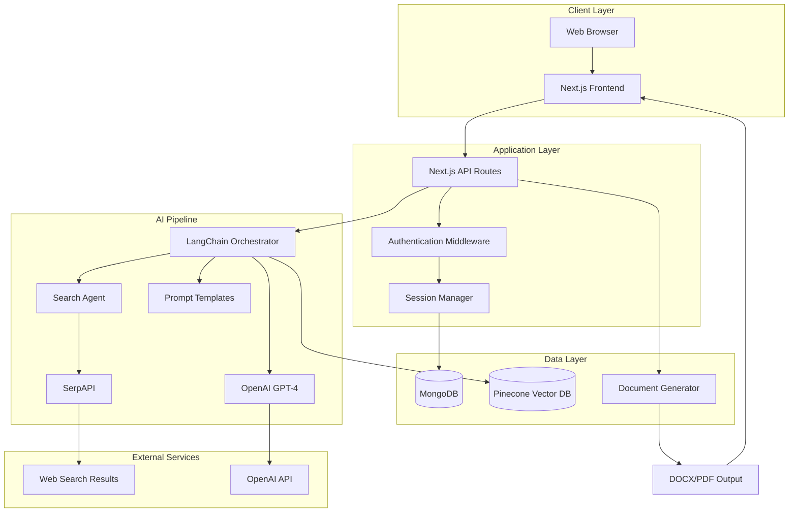
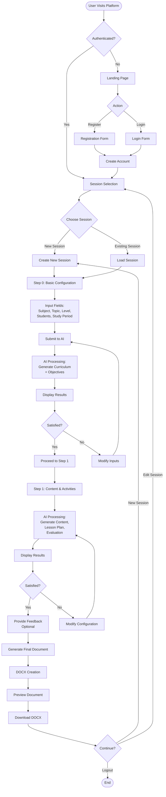
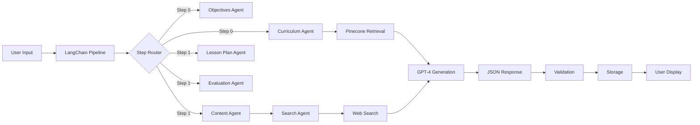

# Inclusive Learning AI Platform - Comprehensive Proposal


**Developed by Prof. Dr. Jaitip Na Songkhla and Thitanat Na Songkhla**  
**Chulalongkorn University**

---

## 📋 Table of Contents

1. [Platform Overview](#platform-overview)
2. [Purpose and Vision](#purpose-and-vision)
3. [Technology Stack](#technology-stack)
4. [System Architecture](#system-architecture)
5. [Database Schema](#database-schema)
6. [User Flow](#user-flow)
7. [Key Features](#key-features)
8. [AI Integration](#ai-integration)
9. [Security & Authentication](#security--authentication)
10. [Deployment & Infrastructure](#deployment--infrastructure)
11. [Future Roadmap](#future-roadmap)

---

## 🎯 Platform Overview

The **Inclusive Learning AI Platform** is an advanced educational technology solution that leverages artificial intelligence to help Thai educators create comprehensive, inclusive lesson plans tailored to diverse student needs. The platform combines cutting-edge AI models with Thailand's national curriculum standards to generate personalized teaching materials that accommodate students with different learning abilities and disabilities.

### Mission Statement

To democratize high-quality, inclusive education by empowering teachers with AI-assisted tools that automatically generate lesson plans following Universal Design for Learning (UDL) principles and Thai national curriculum standards.

---

## 🌟 Purpose and Vision

### Primary Objectives

1. **Automate Lesson Planning**: Reduce teachers' administrative burden by automating the creation of comprehensive lesson plans
2. **Promote Inclusive Education**: Ensure every lesson plan includes accommodations for students with diverse learning needs
3. **Align with Standards**: Maintain compliance with Thai national curriculum standards (ตัวชี้วัด, มาตรฐาน)
4. **Evidence-Based Teaching**: Provide teachers with research-backed UDL strategies and inclusive teaching methods
5. **Personalization at Scale**: Generate customized lesson plans based on subject, grade level, class size, and student composition

### Target Users

- **Primary Users**: K-12 educators in Thailand
- **Secondary Users**: Curriculum developers, special education teachers, school administrators
- **Beneficiaries**: Students with diverse learning needs, including those with disabilities

---

## 💻 Technology Stack

### Frontend

| Technology | Version | Purpose |
|------------|---------|---------|
| **Next.js** | 15.1.7 | React framework with server-side rendering |
| **React** | 19.0.0 | UI component library |
| **TypeScript** | 5.x | Type-safe JavaScript |
| **Material-UI (MUI)** | Latest | Component library for consistent UI |
| **Tailwind CSS** | 3.4.1 | Utility-first CSS framework |
| **Axios** | 1.7.9 | HTTP client for API calls |

### Backend & AI

| Technology | Version | Purpose |
|------------|---------|---------|
| **Next.js API Routes** | 15.1.7 | Serverless API endpoints |
| **LangChain** | 0.3.31 | AI orchestration framework |
| **OpenAI GPT-4** | Latest | Primary language model for content generation |
| **Pinecone** | 5.1.1 | Vector database for semantic search |
| **MongoDB** | 6.13 | NoSQL database for user data and sessions |
| **Mongoose** | 8.10.1 | MongoDB ODM (Object Data Modeling) |

### Document Processing

| Technology | Version | Purpose |
|------------|---------|---------|
| **Puppeteer** | 24.10.2 | Headless browser for PDF generation |
| **pdf-lib** | 1.17.1 | PDF manipulation |
| **docxtemplater** | 3.65.0 | Word document generation |
| **Mammoth** | 1.9.1 | .docx to HTML conversion |
| **Cheerio** | 1.0.0 | HTML parsing and manipulation |

### Search & Data Processing

| Technology | Version | Purpose |
|------------|---------|---------|
| **SerpAPI** | 2.2.1 | Web search integration for research |
| **csv-parser** | 3.2.0 | CSV data processing |
| **d3-dsv** | 2.0.0 | Data parsing utilities |

### Security & Authentication

| Technology | Version | Purpose |
|------------|---------|---------|
| **jsonwebtoken** | 9.0.2 | JWT token generation and validation |
| **bcrypt** | 5.1.1 | Password hashing |

---

## 🏗️ System Architecture

### High-Level Architecture



### Component Architecture

#### 1. **Frontend Components** (`src/components/`)

- **Authentication**: `LoginModal.tsx` - User login and registration
- **Configuration**: `ConfigModal.tsx` - Multi-step lesson plan configuration
- **Display**: `JsonResponse.tsx`, `PdfResponse.tsx` - AI response rendering
- **Admin**: Admin dashboard components for user management

#### 2. **API Routes** (`src/app/api/`)

```
api/
├── auth/           # Authentication endpoints
│   ├── login/      # User login
│   ├── register/   # User registration
│   └── clear_session/ # Session cleanup
├── chat/           # AI conversation endpoints
│   └── step/       # Multi-step lesson generation
├── session/        # Session management
│   ├── [GET]       # Retrieve session data
│   ├── [POST]      # Create/update session
│   └── reflection/ # Save teacher reflections
├── generate/       # Final document generation
├── feedback/       # User feedback collection
└── admin/          # Admin panel endpoints
```

#### 3. **AI Pipeline** (`src/lib/`)

- **searchAgent.ts**: Intelligent web search for educational resources
- **optimizedPipeline.ts**: Main AI processing pipeline
- **promptTemplates.ts**: Structured prompts for each lesson plan section
- **retriever.ts**: Vector database retrieval for curriculum standards
- **docsQuery.ts**: Document querying utilities

---

## 🗄️ Database Schema

### MongoDB Collections

#### 1. **Users Collection**

```typescript
{
  _id: ObjectId,
  email: string,           // Unique user email
  password: string,        // Bcrypt hashed password
  firstName: string,       // User's first name
  lastName: string,        // User's last name
  createdAt: Date,
  updatedAt: Date
}
```

**Indexes**: 
- `email` (unique)
- `_id`

#### 2. **Sessions Collection**

```typescript
{
  _id: ObjectId,
  userId: ObjectId,        // Reference to Users collection
  sessionName: string,     // User-defined session name
  configStep: number,      // Current step (0 or 1)
  configFields: {
    subject: string,       // e.g., "คณิตศาสตร์", "ภาษาไทย"
    lessonTopic: string,   // Lesson topic
    level: string,         // Grade level (e.g., "ป.1", "ม.3")
    numStudents: number,   // Number of students
    studentType: Array<{   // Student composition
      type: string,        // e.g., "นักเรียนทั่วไป", "ADHD"
      percentage: number
    }>,
    studyPeriod: number,   // Hours of instruction
    limitation: string     // Resource limitations
  },
  configResponse: {
    // Step 0 responses
    curriculum?: Object,   // Curriculum standards
    objectives?: Object,   // Learning objectives
    
    // Step 1 responses
    content?: Object,      // Learning content
    lessonPlan?: Object,   // Lesson activities
    evaluation?: Object    // Assessment methods
  },
  reflection: {
    reflection1?: string,  // Post-lesson reflections
    reflection2?: string,
    reflection3?: string,
    reflection4?: string,
    reflection5?: string
  },
  docxBuffer?: Buffer,     // Generated DOCX file
  createdAt: Date,
  updatedAt: Date
}
```

**Indexes**:
- `userId`
- `_id`
- `createdAt` (for sorting)

### Pinecone Vector Database

**Index Name**: `curriculum-standards`

**Vector Schema**:
```typescript
{
  id: string,              // Unique document ID
  values: number[],        // 1536-dimensional embedding vector
  metadata: {
    text: string,          // Original text content
    subject: string,       // Subject area
    level: string,         // Grade level
    standard: string,      // Curriculum standard code
    indicator: string      // Learning indicator
  }
}
```

**Purpose**: Semantic search for relevant curriculum standards and learning indicators based on user input.

---

## 👤 User Flow

### Complete User Journey



### Detailed Flow by Stage

#### **Stage 1: Landing & Authentication**

1. User arrives at landing page (`/`)
2. Sees platform features and benefits
3. Options:
   - **Get Started** → Redirects to session page with login
   - **Register** → Opens registration modal
   - **Login** → Opens login modal

#### **Stage 2: Session Management**

1. After login, user sees session selection modal
2. Options:
   - View all existing sessions (with names and dates)
   - Create new session (prompted for session name)
   - Delete sessions
3. Upon selection, loads session state

#### **Stage 3: Multi-Step Configuration**

##### **Step 0: Curriculum & Objectives**

**User Inputs**:
- กลุ่มสาระการเรียนรู้ (Subject): Dropdown (Math, Science, Thai, etc.)
- หัวข้อบทเรียน (Lesson Topic): Text input
- ระดับชั้น (Grade Level): Dropdown (ป.1-ป.6, ม.1-ม.6)
- จำนวนนักเรียน (Number of Students): Number input
- ประเภทนักเรียน (Student Types): Dynamic multi-select with percentages
  - Types: ทั่วไป (General), ADHD, ออทิสติก (Autistic), สมาธิสั้น (Attention deficit), etc.
- จำนวนชั่วโมง (Study Period): Number input
- ข้อจำกัด (Limitations): Text area

**AI Processing**:
1. Searches Pinecone vector DB for relevant curriculum standards
2. Uses `curriculum` prompt template to generate:
   - มาตรฐาน (Standards)
   - ตัวชี้วัดระหว่างทาง (Interim indicators)
3. Uses `objectives` prompt template to generate:
   - จุดประสงค์ด้านความรู้ (Knowledge objectives)
   - จุดประสงค์ด้านทักษะ (Skill objectives)
   - จุดประสงค์ด้านคุณลักษณะ (Character objectives)

**User Actions**:
- Review generated curriculum and objectives
- Approve and proceed to Step 1, OR
- Modify inputs and regenerate

##### **Step 1: Content & Lesson Plan**

**AI Processing** (uses data from Step 0):
1. **Content Generation**: 
   - Searches web for teaching examples using `searchAgent`
   - Generates สาระการเรียนรู้ (Learning content)
   - Generates สาระสำคัญ (Key concepts)

2. **Lesson Plan Generation**:
   - Creates กิจกรรมการเรียนรู้ (Learning activities)
   - Implements UDL strategies from web research
   - Includes inclusive adaptations for each student type
   - Ensures time allocation matches study period
   - Generates สื่อและอุปกรณ์ (Materials and equipment)

3. **Evaluation Generation**:
   - Creates assessment methods aligned with objectives
   - Includes formative and summative assessments
   - Provides rubrics and success criteria

**User Actions**:
- Review all generated sections
- Provide optional feedback for each section (quality ratings)
- Approve final content

#### **Stage 4: Document Generation**

1. System compiles all AI-generated content
2. Creates DOCX file using `docxtemplater`
3. Stores in session as Base64 buffer
4. User sees document preview (iframe)
5. Download button available

#### **Stage 5: Reflection (Optional)**

After class implementation, teachers can return to add:
- Reflection 1-5: Teaching effectiveness, student engagement, areas for improvement

---

## 🚀 Key Features

### 1. **Multi-Step AI Generation**

- **Progressive Disclosure**: Break complex lesson planning into manageable steps
- **Iterative Refinement**: Users can regenerate any section
- **Context Preservation**: All previous inputs inform subsequent AI generation

### 2. **Intelligent Search Integration**

The **SearchAgent** performs:
- Web searches for teaching methodologies
- UDL strategy research
- Inclusive teaching examples
- Subject-specific pedagogical approaches

### 3. **Vector Database Retrieval**

- **Curriculum Alignment**: Automatically matches lesson topics to Thai national standards
- **Semantic Search**: Uses embeddings to find relevant standards even with different wording
- **Fast Retrieval**: Sub-second search across entire curriculum database

### 4. **Adaptive Content Generation**

AI adjusts outputs based on:
- Student composition (e.g., 70% general, 20% ADHD, 10% autistic)
- Grade level (vocabulary, complexity)
- Time constraints (study period)
- Resource limitations (equipment, technology access)

### 5. **Inclusive Design**

Every lesson plan includes:
- UDL principles (Multiple means of representation, action, engagement)
- Specific adaptations for each student type
- Accessibility considerations
- Differentiated instruction strategies

### 6. **Document Export**

- **DOCX Format**: Editable Microsoft Word documents
- **Formatted Templates**: Professional styling with Thai fonts
- **Structured Content**: Clear sections matching official curriculum requirements

### 7. **Session Management**

- **Multi-Session Support**: Users can create unlimited lesson plans
- **Auto-Save**: Progress saved at each step
- **Resume Capability**: Return to any session anytime
- **Session Naming**: Organize by topic, date, or class

### 8. **Admin Dashboard**

- User management
- Session analytics
- Feedback monitoring
- System statistics

---

## 🤖 AI Integration

### AI Architecture Overview



### Prompt Engineering Strategy

#### **Curriculum Prompt** (`promptTemplates.ts`)

```typescript
[system]: "You are an expert in Thai national curriculum..."
[human]: `
From curriculum data: {context}
Subject: {subject}
Lesson Topic: {lessonTopic}
Grade Level: {level}

Respond in JSON format:
{
  "กลุ่มสาระการเรียนรู้": "...",
  "มาตรฐาน": "...",
  "ตัวชี้วัดระหว่างทาง": "..."
}
`
```

#### **Lesson Plan Prompt** (Nested Structure)

```typescript
[system]: "You are a creative UDL expert..."
[human]: `
Content: {content}
Study Period: {studyPeriod} hours
Students: {numStudents}
Student Types: {studentTypes}

Create JSON with nested structure:
{
  "กิจกรรมการเรียนรู้": {
    "8.1 Introduction (X min)": {
      "1 Activity 1 (Y min)": {
        "details": "...",
        "udl_strategies": "...",
        "inclusive_adaptations": {
          "ADHD students": "...",
          "Autistic students": "..."
        }
      }
    }
  }
}
`
```

### RAG (Retrieval-Augmented Generation)

1. **Document Ingestion**:
   - Thai curriculum standards embedded using OpenAI embeddings
   - Stored in Pinecone with metadata
   - Indexed by subject, level, standard code

2. **Retrieval Process**:
   - User input converted to embedding
   - Top-k similarity search in Pinecone
   - Retrieved standards passed to GPT-4 as context

3. **Generation Enhancement**:
   - GPT-4 uses retrieved standards to ensure compliance
   - Generates content that explicitly cites standard codes
   - Maintains educational rigor and accuracy

### Search Agent Workflow

```typescript
class SearchAgent {
  async performEnhancedSearch(subject, topic, level, studentTypes) {
    // 1. Search for teaching examples
    const examples = await this.searchTeachingProcessExamples(...)
    
    // 2. Search for UDL strategies
    const udl = await this.searchUDLStrategies(...)
    
    // 3. Get detailed lesson info
    const details = await this.getLessonDetails(...)
    
    // 4. Compile and rank results
    return {
      teachingProcessExamples: examples,
      udlStrategies: udl.udlStrategies,
      inclusiveStrategies: udl.inclusiveStrategies,
      lessonDetails: details
    }
  }
}
```

---

## 🔒 Security & Authentication

### Authentication Flow

1. **Registration**:
   - Email validation
   - Password strength requirements
   - Bcrypt hashing (10 salt rounds)
   - User record creation in MongoDB

2. **Login**:
   - Credential verification
   - JWT token generation (7-day expiry)
   - Token stored in localStorage
   - Token included in all API requests

3. **Authorization**:
   - Middleware validates JWT on protected routes
   - userId extracted from token payload
   - Session access restricted to owner

### JWT Token Structure

```typescript
{
  userId: string,        // MongoDB ObjectId
  email: string,
  iat: number,          // Issued at timestamp
  exp: number           // Expiration timestamp (7 days)
}
```

### API Security

```typescript
// Middleware pattern in API routes
export async function POST(request: Request) {
  const token = request.headers.get("Authorization")?.replace("Bearer ", "");
  
  if (!token) {
    return new Response("Unauthorized", { status: 401 });
  }
  
  try {
    const decoded = jwt.verify(token, process.env.JWT_SECRET);
    // Proceed with authorized request
  } catch (error) {
    return new Response("Invalid token", { status: 401 });
  }
}
```

### Data Protection

- **Password Security**: Bcrypt with salt rounds
- **HTTPS Only**: All production traffic encrypted
- **Environment Variables**: Sensitive keys in `.env`
- **No Client-Side Secrets**: API keys server-side only
- **Session Isolation**: Users can only access their own sessions

---

## 🌐 Deployment & Infrastructure

### Development Environment

```bash
# Install dependencies
npm install

# Set environment variables
cp .env.example .env
# Add: MONGODB_URI, OPENAI_API_KEY, PINECONE_API_KEY, JWT_SECRET, SERPER_API_KEY

# Run development server
npm run dev
# Access at http://localhost:3005
```

### Production Deployment (Recommended: Vercel)

1. **Frontend & API**:
   - Platform: Vercel (optimized for Next.js)
   - Region: Singapore (lowest latency for Thailand)
   - Auto-scaling: Serverless functions
   - CDN: Global edge network

2. **Database**:
   - MongoDB Atlas (cloud-hosted MongoDB)
   - Region: AWS Singapore
   - Tier: M10+ for production
   - Backups: Automated daily

3. **Vector Database**:
   - Pinecone (fully managed)
   - Index: 1536 dimensions (OpenAI embeddings)
   - Pods: s1 or p1 depending on scale

4. **Environment Variables**:
   ```env
   MONGODB_URI=mongodb+srv://...
   OPENAI_API_KEY=sk-...
   PINECONE_API_KEY=...
   PINECONE_ENVIRONMENT=...
   PINECONE_INDEX=curriculum-standards
   JWT_SECRET=...
   SERPER_API_KEY=...
   NODE_ENV=production
   ```

### Performance Optimization

- **Static Generation**: Landing page pre-rendered
- **Code Splitting**: Dynamic imports for heavy components
- **Caching**: API responses cached where appropriate
- **Image Optimization**: Next.js automatic image optimization
- **Font Loading**: Optimized with `next/font`

### Monitoring & Analytics

- **Error Tracking**: Vercel Analytics
- **Performance Monitoring**: Web Vitals
- **User Analytics**: Session duration, generation count
- **AI Metrics**: Token usage, response times

---

## 🔮 Future Roadmap

### Phase 1: Enhancement (Q2 2025)

- [ ] **Multi-Language Support**: English interface option
- [ ] **Template Library**: Pre-built lesson plan templates
- [ ] **Collaboration**: Share sessions with colleagues
- [ ] **Export Formats**: PDF, Google Docs integration

### Phase 2: Advanced Features (Q3 2025)

- [ ] **Fine-Tuning**: Custom model trained on successful lesson plans
- [ ] **Assessment Generator**: Automatic quiz and exam creation
- [ ] **Resource Recommender**: AI-suggested teaching materials
- [ ] **Student Progress Tracking**: Link to learning outcomes

### Phase 3: Ecosystem (Q4 2025)

- [ ] **Mobile App**: iOS/Android native apps
- [ ] **School Integration**: LMS connectivity (Moodle, Canvas)
- [ ] **Analytics Dashboard**: Teacher effectiveness insights
- [ ] **Community Platform**: Share and rate lesson plans

### Phase 4: Research & Impact (2026)

- [ ] **Efficacy Studies**: Measure impact on student outcomes
- [ ] **Teacher Training**: Professional development modules
- [ ] **Government Partnership**: Integration with Thai MOE systems
- [ ] **Open Source Components**: Release core tools to community

---

## 📊 Success Metrics

### User Engagement
- **Active Users**: Monthly active teachers
- **Sessions Created**: Total lesson plans generated
- **Retention Rate**: % of users returning within 30 days
- **Average Session Time**: Time spent per lesson plan

### Quality Metrics
- **User Satisfaction**: Feedback ratings (1-5 stars)
- **Document Downloads**: % of sessions resulting in downloads
- **Iteration Rate**: Average regenerations per section
- **Adoption by Student Type**: Diversity represented in plans

### Technical Metrics
- **API Response Time**: < 2s for retrieval, < 30s for generation
- **Uptime**: 99.9% availability
- **Error Rate**: < 0.1% failed requests
- **Token Efficiency**: Cost per lesson plan

---

## 👥 Team & Acknowledgments

### Development Team
- **Prof. Dr. Jaitip Na Songkhla** - Principal Investigator, Educational Technology Expert
- **Thitanat Na Songkhla** - Lead Developer, AI Engineer

### Institutional Support
- **Chulalongkorn University** - Research funding and infrastructure
- **Faculty of Education** - Curriculum expertise and validation

### Technology Partners
- **OpenAI** - GPT-4 API access
- **Pinecone** - Vector database infrastructure
- **Vercel** - Hosting and deployment platform

---

## 📞 Contact & Support

### For Educators
- **Email**: jaitip.n@chula.ac.th
- **Demo Request**: Contact for institutional trials

### For Developers
- **GitHub**: (Coming soon - to be open-sourced)
- **Technical Issues**: Create issue on GitHub repository

### For Researchers
- **Collaboration Inquiries**: Academic partnerships welcome
- **Data Access**: Anonymized data available for approved research

---

## 📜 License

This platform is developed for educational purposes. Commercial use requires permission from Chulalongkorn University.

**Copyright © 2025 Chulalongkorn University. All rights reserved.**

---

## 🙏 Acknowledgments

This project was made possible by:
- Thai educators providing feedback during beta testing
- Students whose diverse needs inspired the inclusive design
- The open-source community for foundational technologies
- Thailand's Ministry of Education for curriculum standards

---

*Last Updated: January 2025*  
*Version: 1.0*  
*Platform Status: Production*
